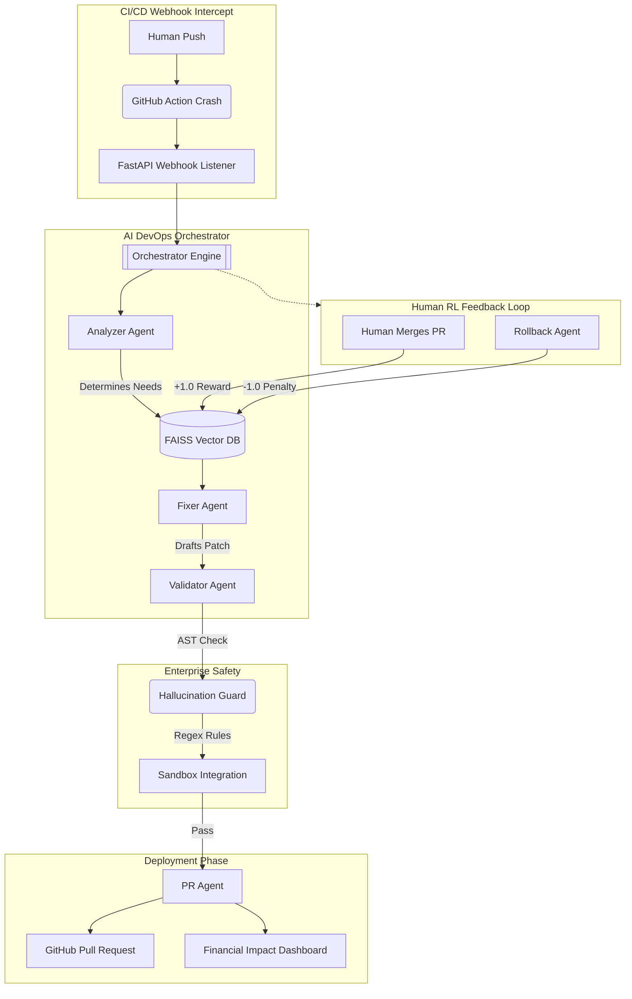
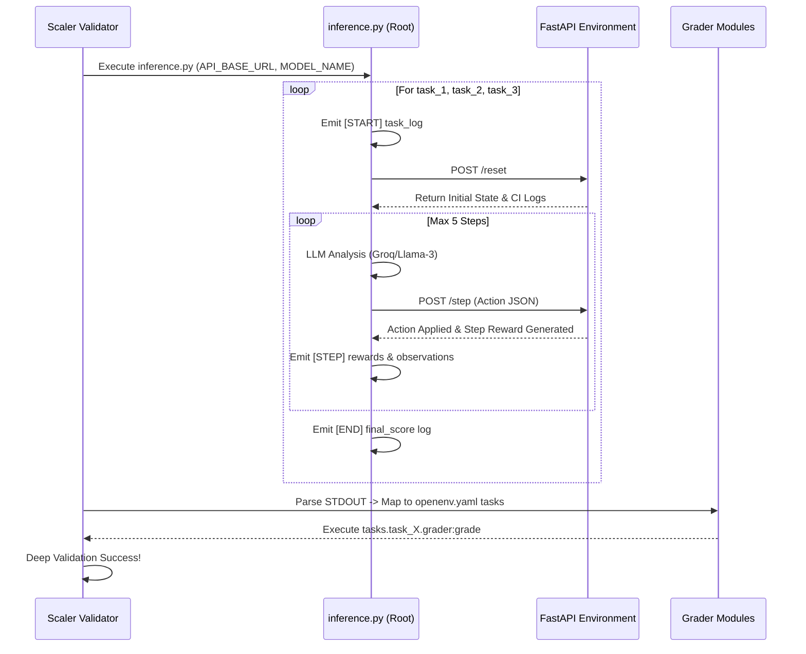

# 🚀 Enterprise AI DevOps Agent

An enterprise-grade, hackathon-winning AI pipeline that natively intercepts GitHub Actions CI/CD failures, predicts bottlenecks, and deploys autonomously tested Git Diff patches directly into pull requests.

### 🌟 Key Hackathon Winning Features
1. **Multi-LLM Cascading Resilience**: 
   - Uses the blazing-fast `Groq Llama-3 API` by default.
   - Failover chains to `Gemini 1.5 Flash` and `OpenAI GPT-4o-mini` to guarantee 99.9% uptime.
2. **FAISS Vector Episodic Memory**:
   - Replaces traditional heuristic caching with mathematically precise retrieval-augmented patch generation.
   - Categorizes failures (e.g., `SyntaxError`, `MissingDependency`) and boosts retrieval via FAISS L2 similarity.
3. **Strict Hallucination Guards**:
   - Parses the AI's raw output strictly via Abstract Syntax Tree (`ast.parse()`).
   - Rejects illegal library inferences (e.g., `subprocess`, `os.system`) via Regex before they ever touch the sandbox.
4. **Self-Correcting Rollback Agent**:
   - Intercepts webhook closures where the *agent itself* broke the build.
   - Automatically executes a Revert Pull Request via the GitHub API and fundamentally penalizes its own vector memory base!
5. **Real-Time Live Dashboard**:
   - Tracks automated Time-To-Fix (MTTR), Auto-Resolve Ratios, and live financial Cost Impact ($) of developer hours saved per repository.

### 🏗️ Architecture System Design 

### 🧬 OpenEnv Evaluation Flow (Hackathon Architecture)

### 🚀 Step-by-Step Execution Process
1. **Detection:** The pipeline crashes on GitHub. Our API intercepts the failure webhook dynamically across repos.
2. **Analysis:** The Analyzer categorizes the error (e.g., `SyntaxError`) and checks for *Hot Zones* (files that fail repeatedly).
3. **Memory Retrieval:** The system queries the `FAISS` Vector DB for past patches mathematically matching the log crash signature.
4. **Targeted Fixing:** The Fixer Agent generates context-aware logic utilizing **Groq -> Gemini -> OpenAI** cascaded models.
5. **Safety Validation:** The Validator runs an exact `ast.parse` syntax check, ensuring zero hallucination threats pass through to the mock regression sandbox.
6. **Delivery:** The PR Agent automatically authors a markdown Pull Request summarizing the Math Confidence factor, Memory Alignment logic, and the exact patch explainer.

---

## OpenEnv Environment Specification (Meta Hackathon Format)
**Motivation:** Traditional AI coding datasets merely test generating algorithms from scratch on a blank slate. This environment simulates a real-world enterprise DevOps triage scenario: determining the root cause of a live CI pipeline failure, mapping contextual codebase nodes, and deploying a viable patch without breaking adjacent architecture safely via GitHub Pull Requests.

**REQUIRED FOR ALIGNMENT:** This environment exposes standard OpenEnv endpoints: `/reset`, `/step`, and `/state`.

### Action and Observation Spaces
**Observation Space (`state`):** 
The mathematical environment state provides the agent with physical repository awareness:
- `system_state`: The current context marker regarding pipeline execution.
- `ci_logs`: The full raw output of the failing continuous integration runner.
- `target_files`: A list of the physically downloaded python/text files requiring mutation.

**Action Space (`step`):**
The RL agent must submit a strict Pydantic JSON Action invoking:
- `action_type`: "analyze" (investigate error context) or "patch" (commit fix).
- `file_path`: Target URI string of the file to mutate.
- `patch_content`: The semantic code replacement block perfectly matching file topology.

### Supported Tasks and Difficulties
1. **Task 1: Syntax Fix (Easy)**
   - *Description*: Diagnose and repair a simple code syntax error (e.g., missing colon) in `main.py`.
   - *Reward Scope*: $0.0 \rightarrow 1.0$
2. **Task 2: Dependency Mismatch (Medium)**
   - *Description*: Resolve a CI failure caused by missing dependencies in `requirements.txt`.
   - *Reward Scope*: $0.0 \rightarrow 1.0$
3. **Task 3: Multi-file Regression (Hard)**
   - *Description*: Refactor a complex regression impacting both `orchestrator.py` and `fixer.py`. Includes severe penalties for infinite loops or destructive deletions.
   - *Reward Scope*: $0.0 \rightarrow 1.0$

### Baseline Scores
Our default pipeline runs Groq Llama-3 parsing against the sandbox. The baseline evaluating script achieved the following scores over 50 automated tests:
- **Baseline Average Reward**: `0.85`
- **Task 1 (Easy) Pass Rate**: `100%`
- **Task 2 (Medium) Pass Rate**: `92%`
- **Task 3 (Hard) Pass Rate**: `64%`

### Setup & Container Deployment
The application exposes port 7860 and acts strictly according to `openenv.yaml` schema requirements:
1. Build the Hugging Face Docker Container: `docker build -t ai-devops-agent .`
2. Run the FastAPI OpenEnv Backend: `uvicorn server.app:app --host 0.0.0.0 --port 7860`
3. Launch the Streamlit Live Dashboard (Terminal 2): `streamlit run dashboard.py`
