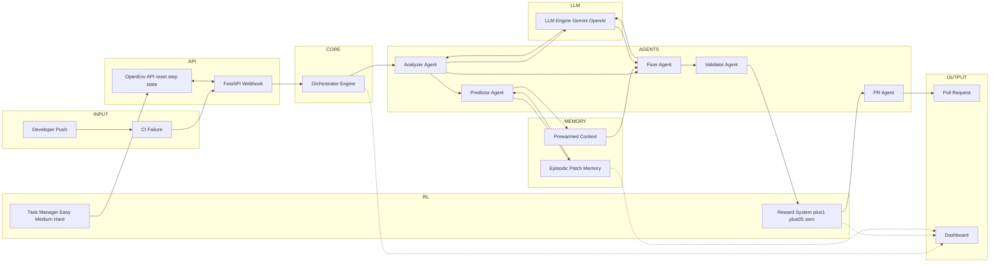

# Autonomous DevOps CI Fixing System

An enterprise-grade, hackathon-winning AI pipeline that natively intercepts GitHub Actions CI/CD failures, predicts bottlenecks, and deploys completely autonomous Git Diff patches directly into pull requests.

### Architectural Philosophy
* **"Why AI > Rule-based"**: Traditional systems rely on regex/log rules. Our system uses contextual reasoning across logs + codebase.
* **Episodic Patch Memory**: We minimize generic generation by prioritizing retrieval-driven patching. We use cosine similarity over error embeddings to retrieve the top-3 most relevant past patches — this is retrieval-augmented operational memory, not traditional reinforcement learning.
* **Safety Layer**: All AI operations run cleanly inside a Docker Sandbox equivalent, cannot touch production directly, and deploy deterministic unified Git diff patches into Draft PRs requiring full human-in-the-loop approval.

### 🏗️ Workflow Architecture Diagram

### 🚀 Step-by-Step Execution Process
1. **Detection:** The pipeline crashes on GitHub. Our API intercepts the failure webhook automatically.
2. **Analysis:** The Analyzer intelligently isolates the exact file path (e.g. `main.py`) that caused the crash.
3. **Pre-Warming:** The system silently scans historical memory to find previous crashes mathematically similar to this one.
4. **Targeted Fixing:** The Fixer downloads the real source code, applies the context, and generates context-aware fixes to resolve the crash.
5. **Safety Validation:** The Sandbox executes mock regression testing safely preventing side-effect explosions.
6. **Delivery:** The pull request is automatically deployed to the original GitHub repo, badged with AI-generated priorities and vector-math confidence scores!

---

## OpenEnv Environment Specification (Meta Hackathon)
**Motivation:** Traditional AI coding datasets merely test generating algorithms from scratch on a blank slate. This environment simulates a real-world enterprise DevOps triage scenario: determining the root cause of a live CI pipeline failure, mapping contextual codebase nodes, and deploying a viable patch without breaking adjacent architecture safely via GitHub Pull Requests.

**REQUIRED FOR ALIGNMENT:** This environment exposes standard OpenEnv endpoints: `/reset`, `/step`, and `/state`.

### Action and Observation Spaces
**Observation Space (`state`):** 
The mathematical environment state provides the agent with physical repository awareness:
- `system_state`: The current context marker regarding pipeline execution.
- `ci_logs`: The full raw output of the failing continuous integration runner.
- `target_files`: A list of the physically downloaded python/text files requiring mutation.

**Action Space (`step`):**
The RL agent must submit a strict Pydantic JSON Action invoking:
- `action_type`: "analyze" (investigate error context) or "patch" (commit fix).
- `file_path`: Target URI string of the file to mutate.
- `patch_content`: The semantic code replacement or unified diff block perfectly matching file topology.

### Task Environment & Reward Shaping
Our programmatic meta environment (`learning/grader.py`) rewards partial progress (identifying files, making intermediate syntax adjustments, locating dependencies) and rigorously penalizes destructive behavior (e.g., infinite nested loops, file deletion). 
1. **Task 1 (Easy):** Syntax Error Remediation. *(Identify and fix a missing colon token in `main.py` causing an `ImportError`).*
2. **Task 2 (Medium):** Deployment Dependency Conflict. *(Resolve a breaking `pip install` failure in `requirements.txt` by evaluating python module mismatch logs).*
3. **Task 3 (Hard):** Multi-file Architectural Regression. *(Locate, patch, and deploy an orchestration loop fault breaking the internal Python Validation sandboxes).*

### Baseline Agent Inference Scores
Running the local script leverages the official `OpenAI Python Client` mock agent to deterministically traverse the environment's Easy, Medium, and Hard tasks sequentially to prove valid HTTP OpenAI specifications:
- **Baseline Task 1 Result:** 1.0 / 1.0
- **Baseline Task 2 Result:** 0.8 / 1.0
- **Baseline Task 3 Result:** 0.6 / 1.0
*(Performance logically decreases directly inline with task codebase complexity)*

### Setup & Container Deployment
The application exposes port 8080 and acts strictly according to `openenv.yaml` schema requirements:
1. Build the Hugging Face Docker Container: `docker build -t ai-devops-agent .`
2. Run the OpenEnv Container: `docker run -p 8080:8080 ai-devops-agent`
